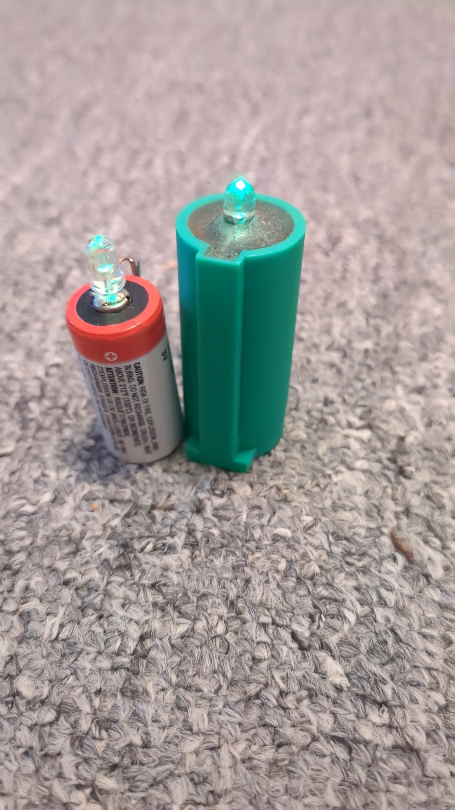
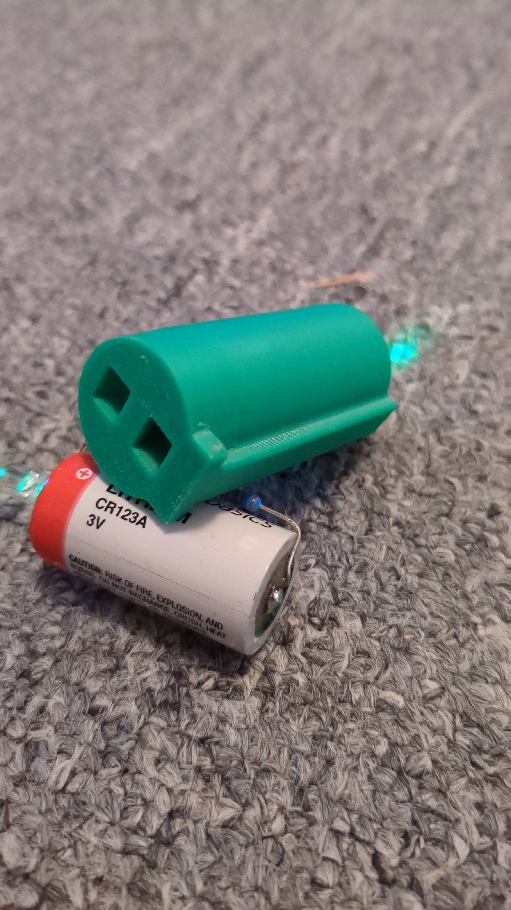
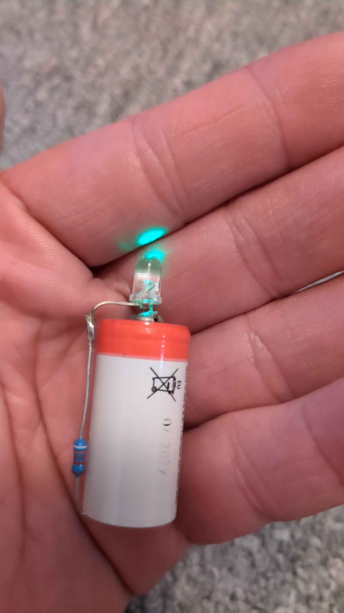
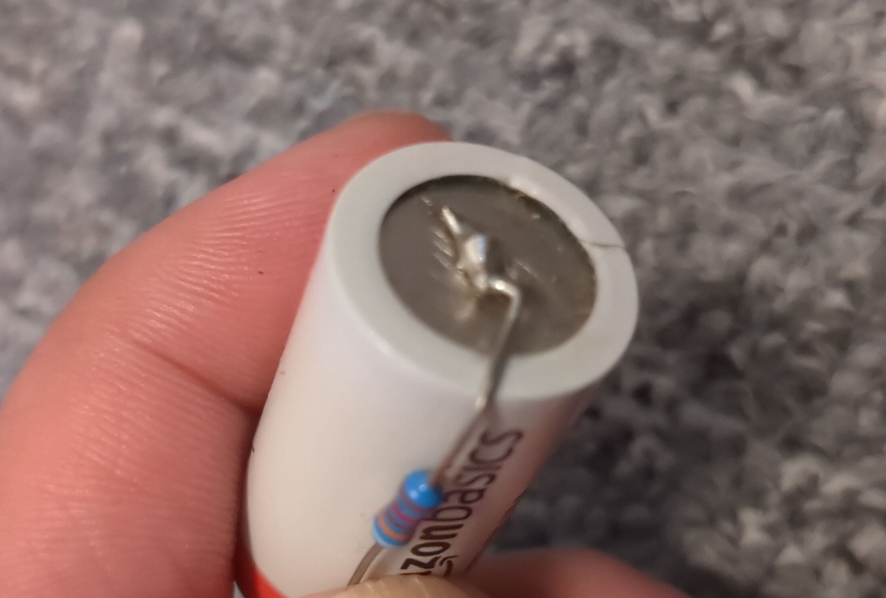
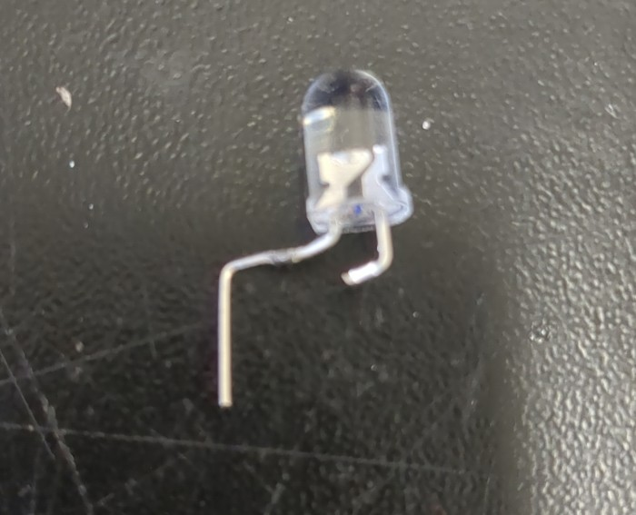
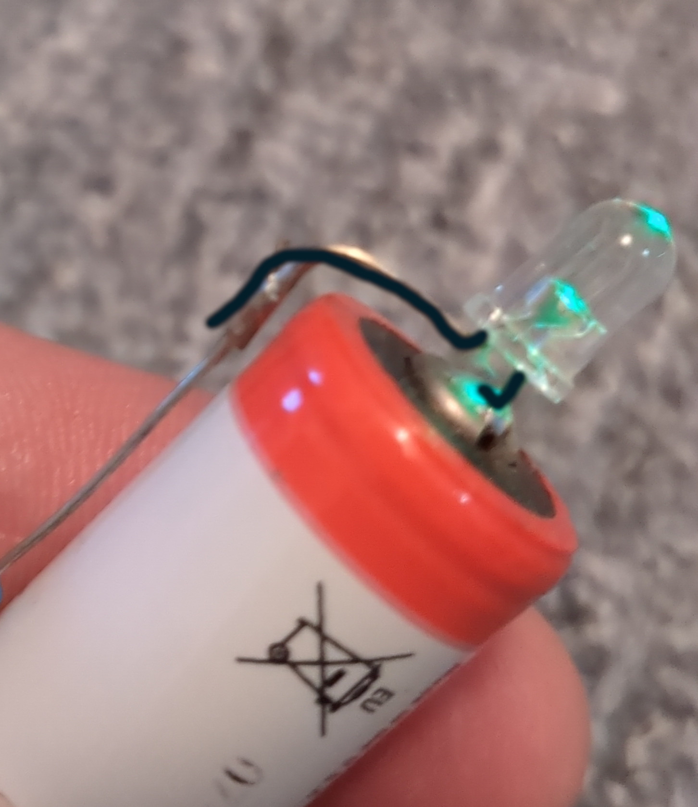
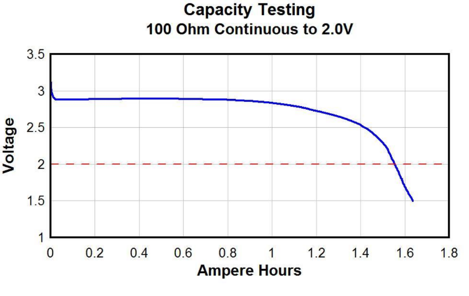
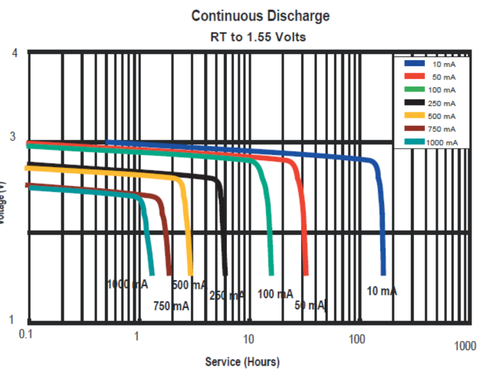
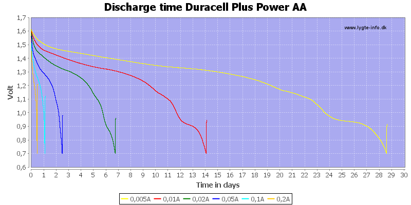
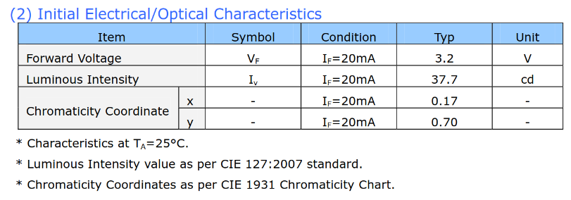

# TritiumLikeLedLight (T3L)
This repositories describes the construction of a LED light that runs continuously for 10years+. The power output is enough to find e.g. a backpack during the dark night or to mark specific obstacles.  
  
  
  
  
  
## Basic construction
As you might not want to read the electrical engineering chapter here are the needed components that most likely will always work:  
  
- 5mm LED green 30° with 15000mcd or more
- any brand non rechargeable CR123a lithium battery with at least 1500mAh
- radial metal film ~90kOhm resistor (1/4W or 1/8W)
  
This will cost less than $3/3€ per piece if multiple are build and a 3D printer is available.  
You need a soldering iron to solder the LED with the resistor to the battery.  
Solder the resistor on the minus pole. You need a bit of heat for this and it helps to scratch the metal a bit:  
  
  
Then bend/cut the LED pins and make sure you use the right polarity to directly solder one LED pin onto the plus pole while the other is bend around and cut to meet with the resistor to close the circuit:  
  
  
  
## The 3D printed case
If water resistance is needed and for more use cases a [3D case](cases/v1/) was constructed. It has the option to add a lanyard, does not roll away and should be filled with resin for electronics.  
As the battery itself is usually magnetic and the case is not bigger by much it is possible to fix the whole system on magnetic surfaces if the used magnet is strong enough.  
  
## The electrical engineering behind the 10years+ promise
This chapter assumes you know your Ohm's and Kirchoff's laws.  

### The battery
The CR123a was selected because of its form factor, chemical composition and capacity.  
  
The form factor is small enough to put a case around and then still be able to put it e.g. on a back pack or even on bigger key chains.  
  
A CR123a is a non rechargeable lithium battery (more precise Lithium/Manganese Dioxide LiMnO<sub>2</sub>) with a shelf life of 10years. Basically all batteries with the same chemical composition would have around the same shelf life. This low self discharge rate makes this battery type ideal for this project.  
What comes with the chemical composition is the voltage of the battery. It needs to be higher than the forward voltage of the chosen LED. Theoretically this is not the case practically it is (look chapter LED for more details).  
The ideal battery for this project would keep a certain voltage until it is completely depleted. The following pictures show graphs (Source: [Duracell](https://www.duracell.com/wp-content/uploads/2021/06/CR123_US.pdf)) of a Duracell CR123a lithium battery:  
  
After the initial voltage drop the voltage stays almost at the same level for the whole battery life.  
  
  
The less current is drawn the more beneficial this will become. This project will draw much less current than 1mA.  
  
Why not cheap alkaline batteries?  
Nowadays modern alkaline batteries also have great shelf life. Usually one needs to combine two to get the required minimum voltage for the chosen LEDs or add voltage boosters (e.g. a [Joule thief](https://en.wikipedia.org/wiki/Joule_thief)) which adds complexity and costs.  
Alkaline batteries are cheaper but also bigger and the discharge curve over time is not as stable as from a lithium battery. The following graph shows a discharge curve over time for low currents for a Duracell AA cell (Source: [lygte-info.dk](https://lygte-info.dk/info/BatteriesLowCurrentDischarge%20UK.html)):  
  
  
As the voltage drops steeper linear over time one will notice a brightness decrease even though the battery is not even close to being empty.  
  
Finally the capacity of a CR123a cell with 1500mAh (see chapter runtime calculation/estimation below) is enough to run for 10years+ with just enough light power output. As this project draws much less current than 1mA the usable capacity is probably even a bit higher as the internal cell resistance does not burn much energy.  
  
### The LED
There are many options to consider when picking a fitting LED.  
  
#### The color
The color determines the forward voltage of the LED as this is an underlying physical principle how LEDs generate the light. When taking a look at the datasheet e.g. from a green Nichia LED NSPG500DS (Source: [Nichia Japan](https://led-ld.nichia.co.jp/api/data/spec/led/NSPG500DS-E(2027).pdf)):  
  
  
The forward voltage is specified with 3.2V which is lower than the CR123a voltage after it's initial voltage drop (see above). So the LED should not work afterwords.  
But an LEDs forward voltage is dependent on the current it consumes. The following diagram shows this relation:  
  
  
The lower the current the lower the forward voltage. The lower the forward voltage the longer the LED will stay on with a CR123a battery as this battery stays at 3V for a very long time an then only shortly before it's empty will drop the voltage.  
This allows almost completely draining the battery.  
  
Red LEDs usually have the lowest forward voltage. Still this project used a green LED as green (and also yellow) can be seen by humans best because of cone cell distribution in our eyes.  
Still as long as the forward voltage fits to the desired brightness (=current) any color will do.  
  
#### The power
The maximum possible emitted light power of the LED also matters. Even though the LED is not driven at full power it is a good (and probably only) indicator how well the LED performs at very low currents. The brighter it runs at high currents the better it also performs at low currents.  
  
#### The angle
A similar relation exists for the radiation angle. If the same LED is emitting the same amount of light it does look different for a 15° LED and a 60° LED. While the 15° LED seems to be brighter when looked directly into, the 60° can be better seen if the light is not directly pointing at you. This can be compared to flashlights where one has the options for a flooder or a thrower.  
All the pictures you can see at the top have a no-name LED with 30° radiation angle and a rated output of 15000mcd using a 93.1kOhm resistor.  
  
### The resistor
Any metal film resistor will do. As this project uses less then 1mA the power rating doesn't really matter. Pick a 1/8W or 1/4W as they probably the cheapest because they are mass produced standard products.  
Important though is the value of the resistor. The value determines both brightness of the LED and runtime.  
The lower the resistor value the more current can flow and the brighter the LED will be. The brighter the LED though the lower the runtime before the battery depletes (see below Runtime calculation/estimation).  
  
### Runtime calculation/estimation
For calculating the system runtime the effective current that is drawn from the battery is needed.  
Assuming for now we know this current calculating the runtime is easy:  
  
```runtime in hours = battery capacity in mAh / effective current in mA```  
  
Example calculation where 1mA is drawn from a battery with 1500mAh:  
  
```1500mAh/1mA = 1500h or 62.5 days ```  
  
If this formula is reversed we can determine what the maximum allowed effective current flow is to reach 10years:  
  
``` 1500mAh/87600h = 17.1µA ```  
  
This is an idealistic number if all other discharging effects are left out.  
Based on the discharge curve above assuming 3V average voltage this would lead to a resistor of ~175kOhm. But this does not take the voltage drop into account the LED creates. As seen above no diagrams are available for lower currents. As an estimation (and based on my personal measurements for a green LED) 2.1V is assumed.  
As the current flow needs to be the same within one closed circuit Ohm's law can be used for the adjusted resistor value that takes the LEDs voltage drop (or additional resistance) into account:  
  
```
voltage drop over the resistor = 3V - 2.1V = 0.9V
resistor value = 0.9V/17.1µA = 52.6kOhm
```
  
52.6kOhm is the base line. The absolute minimal resistor value. If all other issues like self discharge, LED aging and battery voltage drop in later stages are left out. And based on the assumed LED voltage drop. One would need to measure this more exactly for each LED color selected.  
  
I went with 93.1kOhm that resulted in a brightness that was good enough for me on my no-name green LEDs.  
They went into operation August 2017 and in July 2025 the battery voltage is at 3.060V and the LEDs voltage drop is 2.12V which translates to 10µA current and an estimated (ideal) end of life of these prototypes in early 2034.  
