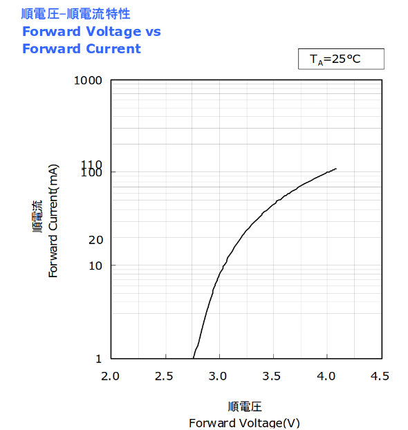

# TritiumLikeLedLight (T3L)
This repository describes the construction of an LED light that runs continuously for 10+ years. The power output is sufficient to find for example a backpack (when the light is attached to it) in complete darkness or to mark specific obstacles.  
  
  
  
  
  
## Basic construction
If you don’t want to dive into the electrical engineering details, here are the required components that will almost always work:  
  
- 5 mm green LED, 30° beam angle, 15,000 mcd or higher
- Any brand of non-rechargeable CR123A lithium battery with at least 1500 mAh
- Radial metal film resistor ~90 kΩ (1/4 W or 1/8 W)
- Optional: 3D printer for a waterproof case
  
The total cost is less than $3/3€ per unit if multiple are built and a 3D printer is available.  
  
### Building
You will need a soldering iron to solder the LED and the resistor to the battery.  
Solder the resistor to the negative pole. You’ll need some heat for this, and it helps to scratch the metal surface a bit:  
  
  
Then bend/cut the LED pins and make sure you use the correct polarity. Solder one LED pin directly to the positive pole, while the other pin is bent and cut to meet the resistor’s free end, closing the circuit:  
  
  
  
## The 3D printed case
If water resistance is needed, or for general convenience, a [3D case](cases/v1/) was designed. It includes an option to attach a lanyard, prevents the device from rolling away, and should be filled with resin to protect the circuit from water.  
The 3D case is not completely round. The flat side can also be used to add a name or a date when the system was put into operation.  
Since the battery itself is typically magnetic and the case adds minimal extra size, the whole system can also be mounted to magnetic surfaces if a strong enough magnet is used.  
  
## The electrical engineering behind the 10+ year promise
This chapter assumes familiarity with Ohm’s law and Kirchhoff’s laws.  

### The battery
The CR123A was selected for its form factor, chemical composition, and capacity.  
  
The form factor is compact enough to fit inside a case while still allowing attachment to a backpack or even a large keychain.  
  
A CR123A is a non-rechargeable lithium battery (more precisely Lithium/Manganese Dioxide, LiMnO<sub>2</sub>) with a shelf life of 10 years. Basically, all batteries with the same chemistry have a similar shelf life. This low self-discharge rate makes this type ideal for the project.  
The chemical composition also determines the nominal voltage. It must be higher than the forward voltage of the selected LED. Theoretically this shouldn’t work, but practically it does (see chapter LED below).  
The ideal battery for this project would keep a certain voltage until it is completely depleted. The following pictures show graphs (Source: [Duracell](https://www.duracell.com/wp-content/uploads/2021/06/CR123_US.pdf)) of a Duracell CR123a lithium battery:  
  
After the initial voltage drop, the battery maintains nearly the same voltage for most of its life.  
  
  
The less current is drawn, the more beneficial this becomes. This project consumes far less than 1 mA.  
  
Why not cheap alkaline batteries?  
Modern alkaline batteries also have good shelf life. However, two cells are usually required to reach the minimum voltage for the chosen LEDs, or you need a voltage booster (e.g. a [Joule thief](https://en.wikipedia.org/wiki/Joule_thief)), which adds complexity and cost.  
Alkaline batteries are cheaper but larger, and their discharge curve is less stable than that of lithium cells. The following graph shows a low-current discharge curve for a Duracell AA cell (Source: [lygte-info.dk](https://lygte-info.dk/info/BatteriesLowCurrentDischarge%20UK.html)):  
  
  
Because the voltage decreases steadily over time, brightness fades long before the cell is empty.  
  
Finally, the 1500 mAh capacity of a CR123A cell (see Runtime calculation/estimation below) is enough to power the light for 10+ years at usable brightness. Since this project draws far less than 1 mA, the effective usable capacity is even higher, as little energy is wasted to internal resistance.  
  
### The LED
Several factors matter when choosing an LED.  
  
#### The color
The color determines the forward voltage, as this is a physical property of how LEDs generate light. For example, a green Nichia NSPG500DS LED (Source: [Nichia Japan](https://led-ld.nichia.co.jp/api/data/spec/led/NSPG500DS-E(2027).pdf)) specifies:  
  
  
The forward voltage is listed as 3.2 V, which is higher than the CR123A’s voltage after its initial drop. So theoretically, it shouldn’t work.  
But forward voltage depends on current. The diagram below shows this relation:  
  
  
At very low current, the forward voltage decreases. Since a CR123A stays at ~3 V for most of its life, the LED continues to operate until near depletion.  
This allows nearly complete usage of the battery.  
  
Red LEDs have the lowest forward voltage. Still, green (and yellow) are preferred because the human eye is most sensitive to them due to cone cell distribution.  
Any color works as long as the forward voltage/current relationship is suitable.  
  
#### The power
Maximum light output is also relevant. Even though the LED is not run at full power, high maximum brightness usually correlates with better performance at very low currents.  
  
#### The angle
Beam angle also matters. Two LEDs with the same total output but different angles (e.g. 15° vs 60°) will look different: the 15° LED looks brighter when viewed directly, while the 60° LED is more visible from off angles. This is similar to the difference between “thrower” and “flooder” flashlights.  
All photos shown above use a no-name 30° LED rated 15,000 mcd, with a 93.1 kΩ resistor.  
  
### The resistor
Any metal film resistor works. Since the project consumes <1 mA, the power rating is irrelevant. Use 1/8 W or 1/4 W standard values (cheap and widely available).  
What matters is the resistance value, which determines both brightness and runtime.  
Lower resistance → more current → brighter light but shorter runtime.  
Higher resistance → dimmer light but longer runtime.  
  
### Runtime calculation/estimation
To estimate runtime, calculate the effective current draw.  
Assuming for now we know this current calculating the runtime is easy:  
  
```runtime (hours) = battery capacity (mAh) / effective current (mA)```  
  
Example: If 1 mA is drawn from a 1500 mAh cell:  
  
```1500 mAh / 1 mA = 1500 h ≈ 62.5 days```  
  
To run for 10 years, the maximum average current allowed is:  
  
```1500 mAh / 87,600 h = 17.1 µA```  
  
This is idealized, ignoring self-discharge and other losses.  
Assuming 3 V average battery voltage, this corresponds to ~175 kΩ. But this ignores the LED’s forward voltage. Based on measurements, assume ~2.1 V for a green LED:  
  
```
Voltage across resistor = 3.0 V – 2.1 V = 0.9 V
Resistor value = 0.9 V / 17.1 µA ≈ 52.6 kΩ
```
  
52.6 kΩ is the absolute minimum theoretical value, assuming no LED aging, no extra losses, and ideal discharge.   Actual LED forward voltage must be measured for each color/LED.  
  
I chose 93.1 kΩ, which gave acceptable brightness with no-name green LEDs.  
The first prototypes went into operation in August 2017. As of July 2025, the battery voltage is 3.060 V and the LED forward voltage is 2.12 V, giving ~10 µA current. This translates to an estimated end of life in early 2034.  
